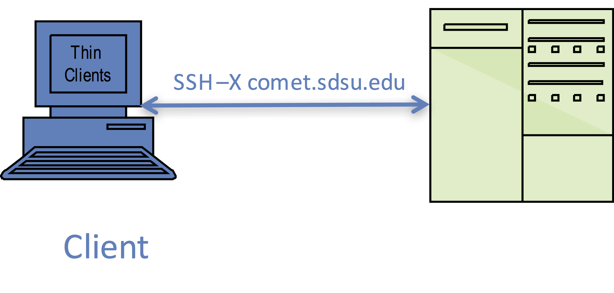
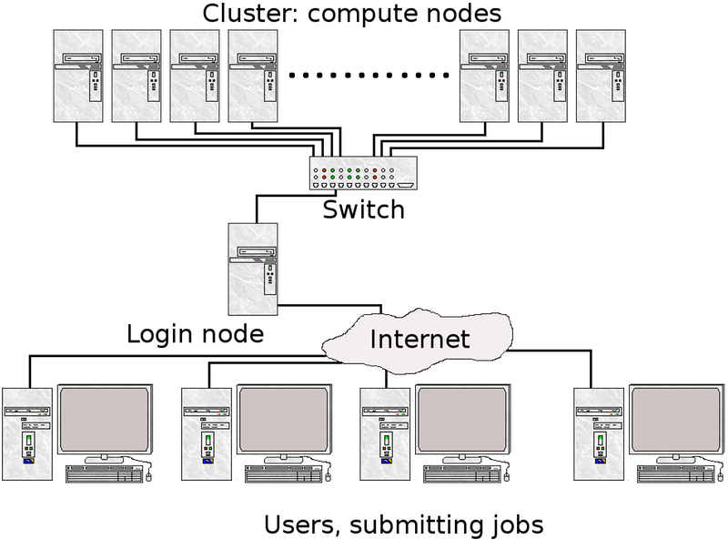

# Preparing for the SDSC Summer Institute: Logging onto Comet


[//]: # " Comment example "

[//]: # ( Comment2 )

In this exercise, you will use your class training account to log onto the Comet cluster. This exercise verifies that your account is working, that your laptop is properly configured, and that your Comet user environment is correctly setup.

<a name="top">In this document, we will show you how to:
    
* [Obtain your class account](#obtain-your-class-account)
* [Using the Terminal Application to connect to Comet](#term-app)
    - [Mac Users](#term-app-mac-users)
    - [Windows Users](#term-app-windows-users)
    - [Terminal Connection Example](#term-app-example)
    - [Getting Domain Name & Host Information](#term-app-dn-info)
* [Expand your knowledge using Comet User guide](#comet-user-guide)

Note: if you have any difficulties completing this task, please contact Institute staff at <consult@sdsc.edu>.

## <a name="obtain-your-class-account"></a>Obtain your class account:

We are asking all attendees to use the training accounts that we will be providing, even if you already have your own account. This will minimize problems related to custom configurations (e.g. environment variables, choice of shell, etc.) that may cause some of the hands-on examples to break and gives participants access to the Comet reservation created for the workshop.

**Notes:**
* You should have gotten email for the Institute staff welcoming you to the Institute, with instructions about how to obtain your account information. If you did not recieve these instructions, please contact us at <consult@sdsc.edu>.
* You should have been given your account information ( `<username>`  and `<password>` by Institute staff. If you do not have a class account, please contact us at <consult@sdsc.edu>.
* If you forgot your password, please contact <consult@sdsc.edu>.

[Back to Top](#top)
<hr>

## <a name="term-app"></a>How to Use the Terminal Application:

The terminal applications are used to connect clients (you and your laptop) to remote computers (such as Comet). See https://en.wikipedia.org/wiki/Secure_Shell for more information. The best known example of using a terminal is for logging in/connecting to a remote computer systems by users. This is called a client-server connection. Terminals are interactive: you type in a command to run, and the outputs are displayed on the terminal. Executing any command is done by typing it and pressing Enter.



SSH provides a secure channel over any network in a client-server architecture. You will be using your laptop to access SDSC’s HPC systems using the secure shell command `ssh`. It is essential that you be able to run secure shell (or a similar connection tool) with X11 forwarding enabled, which allows you to have data encryption and to launch windows applications (e.g. plotting, or a browser).

*NOTE: The `hostname` for Comet is `comet.sdsc.edu`



[Back to Top](#top)
<hr>

## <a name="term-app-mac-users"></a>Mac Users
For Mac users, the Terminal application is typically used for connections. This is done from the command line:

    ssh -X username@<hostname>

 If you are having trouble, try running `ssh` in verbose mode:

     ssh -v -X username@hostname


[Back to Top](#top)
<hr>

## <a name="term-app-windows-users"></a>Windows users
Windows users will need to run an X Server and an ssh-like client. [Cygwin](https://www.cygwin.com) provides a comprehensive Linux-like environment and an X server (Cygwin/X). Putty will also work for direct access to Comet, it is only used for file transfers. For download and installation instructions, see:

* http://www.cygwin.com/
* http://x.cygwin.com/
* https://www.putty.org/

[Back to Top](#top)
<hr>

## <a name="term-app-example"></a>Example of a terminal connection:
```
[localuser@localhost]: ssh -X username@comet.sdsc.edu
Warning: untrusted X11 forwarding setup failed: xauth key data not generated
Last login: Tue Jul 17 12:15:18 2018 from wireless-169-228-90-10.ucsd.edu
Rocks 6.2 (SideWinder)
Profile built 16:44 08-Feb-2016

Kickstarted 17:18 08-Feb-2016

                      WELCOME TO
      __________________  __  _______________
        -----/ ____/ __ \/  |/  / ____/_  __/
          --/ /   / / / / /|_/ / __/   / /
           / /___/ /_/ / /  / / /___  / /
           \____/\____/_/  /_/_____/ /_/

*******************************************************************************

[1] Example Scripts: /share/apps/examples

[2] Filesystems:

     (a) Lustre scratch filesystem : /oasis/scratch/comet/$USER/temp_project
         (Preferred: Scalable large block I/O)

     (b) Compute/GPU node local SSD storage: /scratch/$USER/$SLURM_JOBID
         (Meta-data intensive jobs, high IOPs)

     (c) Lustre projects filesystem: /oasis/projects/nsf

     (d) /home/$USER : Only for source files, libraries, binaries.
         *Do not* use for I/O intensive jobs.

[3] Comet User Guide: http://www.sdsc.edu/support/user_guides/comet.html
******************************************************************************
[username@comet-ln2 ~]$
```

[Back to Top](#top)
<hr>

## <a name="term-app-dn-info"></a>Getting Domain Name & Host Information
Each machine you work with will have a `<domain_name>`,  `<hostname>` or `<ip_address>`. You can learn about IP addresses and domain names here: https://computer.howstuffworks.com/dns.htm.

* NOTE: The *DN* (domain name) for Comet is    `comet.sdsc.edu`

You may need to know the physical IP address of the cluster. To do this, run the `nslookup` command from the command line of your terminal window
```
[username@comet:] nslookup comet.sdsc.edu
Server:		192.168.86.1
Address:	192.168.86.1#53

Non-authoritative answer:
Name:	comet.sdsc.edu
Address: 198.202.113.253
Name:	comet.sdsc.edu
Address: 198.202.113.252
```

The IP address is the  line labeled "Address" and for Comet there are two. YOu can log onto Comet using either the DN or the IP addresses.

[Back to Top](#top)

<hr>

## <a name="comet-user-guide"></a>Comet User Guide

Please read the Comet user guide and familiarize yourself with the hardware, file systems, batch job submission, compilers and modules. The guide can be found here:

http://www.sdsc.edu/support/user_guides/comet.html
