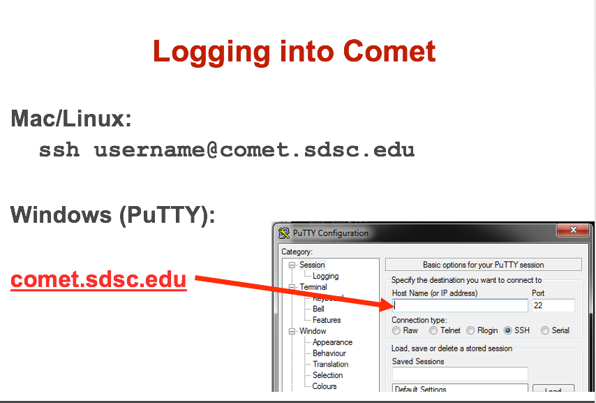

# SDSC 2018 Webinar Series Topic: Introduction to Running Jobs on Comet 

Presented by Mary Thomas (SDSC,  <mpthomas@ucsd.edu> )
<hr>
In this tutorial, you will learn how to compile and run jobs on Comet, where to run them, and how to run batch jobs.
The commands below can be cut & pasted into the comet terminal window.

Requirements:
* You must have a comet account in order to access the system. 
    * To obtain a trial account:  http://www.sdsc.edu/support/user_guides/comet.html#trial_accounts
* You must be familiar with running basic Unix commands: see the following tutorials at:
    * https://github.com/marypthomas/sdsc-training/tree/master/introduction-to-running-jobs-on-comet/preparation
* Note: The `hostname` for Comet is `comet.sdsc.edu`

<em>If you have any difficulties completing these tasks, please contact SDSC Consulting group at <consult@sdsc.edu>.</em>
<hr>

<a name="top">Contents:
* [Comet Overview](#overview)
    * [Comet Architecture](#network-arch)
    * [Comet File Systems](#file-systems)

* [Getting Started - Comet System Environment](#sys-env)
    * [Comet Accounts](#comet-accounts)
    * [Logging Onto Comet](#comet-logon)
    * [Obtaining Example Code](#example-code)
    
* [Modules: Managing User Environments](#modules)
    * [Common module commands](#module-commands)
    * [Load and Check Modules and Environment](#load-and-check-module-env)
    * [Using Scripts to Load Module Environments](#module-load-scripts)
    * [Module Error: command not found](#module-error)

* [Compiling & Linking](#compilers)
    * [Supported Compiler Types](#compilers-supported)
    * [Using the Intel Compilers](#compilers-intel)
    * [Using the PGI Compilers](#compilers-pgi)
    * [Using the GNU Compilers](#compilers-gnu)
    
* [Running Jobs on Comet](#running-jobs)
    * [Command Line Jobs](#running-jobs-cmdline)
    * [Batch Jobs using SLURM](#running-jobs-slurm)
    * [Slurm Commands](#running-jobs-slurm-commands)

* [Hands-on Examples: CPU Computing](#putting-it-all-together)
    * [Hello World (MPI)](#hello-world-mpi)
        * [Hello World (MPI): Compiling](#helloworld-mpi-compile)
        * [Hello World (MPI): Batch Script Submission](#helloworld-mpi-batch-submit)
        * [Hello World (MPI): Batch Script Output](#helloworld-mpi-batch-output)
    * [Hello World (OpenMP)](#helloworld-omp)
        * [Hello World (OpenMP): Compiling](#helloworld-omp-compile)
        * [Hello World (OpenMP): Interactive jobs](#helloworld-omp-interactive)
        * [Hello World (OpenMP): Batch Script Submission](#helloworld-omp-batch-submit)
        * [Hello World (OpenMP): Batch Script Output](#helloworld-omp-batch-output)
    * [Running Hybrid (MPI + OpenMP) Jobs](#hybrid-mpi-omp)
        * [Hybrid (MPI + OpenMP): Compiling](#hybrid-mpi-omp-compile)
        * [Hybrid (MPI + OpenMP): Batch Script Submission](#hybrid-mpi-omp-batch-submit)
        * [Hybrid (MPI + OpenMP): Batch Script Output](#hybrid-mpi-omp-output)

* [Compiling and Running GPU/CUDA Jobs](#comp-and-run-cuda-jobs)
    * [GPU Hello World (GPU) ](#hello-world-gpu)
        * [GPU Hello World: Compiling](#hello-world-gpu-compile)
        * [GPU Hello World: Batch Script Submission](#hello-world-gpu-batch-submit)
        * [GPU Hello World: Batch Job Output](#hello-world-gpu-batch-output)
    * [GPU Enumeration ](#enum-gpu)
        * [GPU Enumeration: Compiling](#enum-gpu-compile)
        * [GPU Enumeration: Batch Script Submission](#enum-gpu-batch-submit)
        * [GPU Enumeration: Batch Job Output](#enum-gpu-batch-output )
    * [CUDA Mat-Mult](#mat-mul-gpu)
        * [Matrix Mult. (GPU): Compiling](#mat-mul-gpu-compile)
        * [Matrix Mult. (GPU): Batch Script Submission](#mat-mul-gpu-batch-submit)
        * [Matrix Mult. (GPU): Batch Job Output](#mat-mul-gpu-batch-output )

[Back to Top](#top)
<hr>

## <a name="overview"></a>Comet Overview:

### HPC for the "long tail of science:"
* Designed and operated on the principle that the majority of computational research is performed at modest scale: large number jobs that run for less than 48 hours, but can be computationally intensvie and generate large amounts of data.
* An NSF-funded system available through the eXtreme Science and Engineering Discovery Environment (XSEDE) program.
* Also supports science gateways.


* ~67 TF supercomputer in a rack
* 27 single-rack supercomputers


[Back to Top](#top)
<hr>

<a name="network-arch"></a>

[Back to Top](#top)
<hr>

<a name="file-systems"></a>
* Lustre filesystems – Good for scalable large block I/O
    * Accessible from all compute and GPU nodes.
    * /oasis/scratch/comet - 2.5PB, peak performance: 100GB/s. Good location for storing large scale scratch data during a job.
    * /oasis/projects/nsf - 2.5PB, peak performance: 100 GB/s. Long term storage.
    * *Not good for lots of small files or small block I/O.*

* SSD filesystems
    * /scratch local to each native compute node – 210GB on regular compute nodes, 285GB on GPU, large memory nodes, 1.4TB on selected compute nodes.
    * SSD location is good for writing small files and temporary scratch files. Purged at the end of a job.

* Home directories (/home/$USER)
    * Source trees, binaries, and small input files.
    * *Not good for large scale I/O.*


[Back to Top](#top)
<hr>

## <a name="sys-env"></a>Getting Started on Comet

### <a name="comet-accounts"></a>Comet Accounts
You must have a comet account in order to access the system. 
* Obtain a trial account here:  http://www.sdsc.edu/support/user_guides/comet.html#trial_accounts
* You can use your XSEDE account.

### <a name="comet-logon"></a>Logging Onto Comet
Details about how to access Comet under different circumstances are described in the Comet User Guide:
 http://www.sdsc.edu/support/user_guides/comet.html#access

 </a>

```
[username@gidget:~]
[username@gidget:~] ssh -Y comet.sdsc.edu
Warning: No xauth data; using fake authentication data for X11 forwarding.
Last login: Tue Jul 17 12:08:53 2018 from wireless-169-228-90-10.ucsd.edu
Rocks 6.2 (SideWinder)
Profile built 16:45 08-Feb-2016

Kickstarted 17:27 08-Feb-2016

                      WELCOME TO
      __________________  __  _______________
        -----/ ____/ __ \/  |/  / ____/_  __/
          --/ /   / / / / /|_/ / __/   / /
           / /___/ /_/ / /  / / /___  / /
           \____/\____/_/  /_/_____/ /_/

*******************************************************************************

[1] Example Scripts: /share/apps/examples

[2] Filesystems:

     (a) Lustre scratch filesystem : /oasis/scratch/comet/$USER/temp_project
         (Preferred: Scalable large block I/O)

     (b) Compute/GPU node local SSD storage: /scratch/$USER/$SLURM_JOBID
         (Meta-data intensive jobs, high IOPs)

     (c) Lustre projects filesystem: /oasis/projects/nsf

     (d) /home/$USER : Only for source files, libraries, binaries.
         *Do not* use for I/O intensive jobs.

[3] Comet User Guide: http://www.sdsc.edu/support/user_guides/comet.html
******************************************************************************
[username@comet-ln3 ~]$
```

[Back to Top](#top)
<hr>

### <a name="example-code"></a>Obtaining Example Code
* Create a test directory hold the comet example files:
```
[comet-ln2 ~]$ mkdir comet-examples
[comet-ln2 ~]$ ls -al
total 166
drwxr-x---   8 user user300    24 Jul 17 20:20 .
drwxr-xr-x 139 root    root       0 Jul 17 20:17 ..
-rw-r--r--   1 user use300  2487 Jun 23  2017 .alias
-rw-------   1 user use300 14247 Jul 17 12:11 .bash_history
-rw-r--r--   1 user use300    18 Jun 19  2017 .bash_logout
-rw-r--r--   1 user use300   176 Jun 19  2017 .bash_profile
-rw-r--r--   1 user use300   159 Jul 17 18:24 .bashrc
drwxr-xr-x   2 user use300     2 Jul 17 20:20 comet-examples
[snip extra lines]
[comet-ln2 ~]$ cd comet-examples/
[comet-ln2 comet-examples]$ pwd
/home/user/comet-examples
[comet-ln2 comet-examples]$
```

* Copy the `PHYS244 directory` from the /examples directory to your 'comet-examples' directory, which is located in your home (`/home/username`) directory. Note: you should have completed the creation of this directory as part of the *Getting Started* and *Basic Skills* preparation work:
https://github.com/sdsc/sdsc-summer-institute-2018/tree/master/0_preparation
```
[username@comet-ln3 ~]$ ls -al /share/apps/examples/PHYS244/
total 64
drwxr-xr-x 16 mahidhar use300 4096 Apr 24 21:57 .
drwxrwxr-x 58 mahidhar use300 4096 Jul 29 11:36 ..
drwxr-xr-x  2 mahidhar use300 4096 Apr 16 22:46 COMPILER_EXAMPLES
drwxr-xr-x  2 mahidhar use300 4096 Apr 16 21:52 CUDA
drwxr-xr-x  2 mahidhar use300 4096 May 31 13:24 debug
drwxr-xr-x  3 mahidhar use300 4096 Apr 19 13:15 HADOOP
drwxr-xr-x  2 mahidhar use300 4096 Apr 16 21:52 HYBRID
drwxr-xr-x  2 mahidhar use300 4096 Apr 16 21:52 LOCALSCRATCH
drwxr-xr-x  2 mahidhar use300 4096 Apr 24 21:57 LOCALSCRATCH2
drwxr-xr-x  2 mahidhar use300 4096 Apr 16 23:30 MKL
drwxr-xr-x  4 mahidhar use300 4096 Apr 16 21:52 MPI
drwxr-xr-x  2 mahidhar use300 4096 Apr 16 21:52 OpenACC
drwxr-xr-x  2 mahidhar use300 4096 Apr 16 21:52 OPENMP
drwxr-xr-x  3 mahidhar use300 4096 Apr 19 13:11 pytorch
drwxr-xr-x  4 mahidhar use300 4096 Apr 19 13:11 SPARK
drwxr-xr-x  4 mahidhar use300 4096 Apr 19 13:14 TensorFlow
```
Copy the 'PHYS244' directory into your `comet-examples` directory:
```
[username@comet-ln3 ~]$
[username@comet-ln3 ~]$ cp -r /share/apps/examples/PHYS244/ comet-examples/
[username@comet-ln3 ~]$ ls -al comet-examples/
total 105
drwxr-xr-x  5 username use300   6 Aug  5 19:02 .
drwxr-x--- 10 username use300  27 Aug  5 17:59 ..
drwxr-xr-x 16 username use300  16 Aug  5 19:02 PHYS244
[username@comet-ln3 ~]$ cd comet-examples/PHYS244/
[username@comet-ln3 PHYS244]$ ls -al
total 212
drwxr-xr-x 16 username use300 16 Aug  5 19:02 .
drwxr-xr-x  5 username use300  6 Aug  5 19:02 ..
drwxr-xr-x  2 username use300  5 Aug  5 19:02 COMPILER_EXAMPLES
drwxr-xr-x  2 username use300 11 Aug  5 19:02 CUDA
drwxr-xr-x  2 username use300 11 Aug  5 19:02 debug
drwxr-xr-x  3 username use300  3 Aug  5 19:02 HADOOP
drwxr-xr-x  2 username use300  5 Aug  5 19:02 HYBRID
drwxr-xr-x  2 username use300  6 Aug  5 19:02 LOCALSCRATCH
drwxr-xr-x  2 username use300  5 Aug  5 19:02 LOCALSCRATCH2
drwxr-xr-x  2 username use300  8 Aug  5 19:02 MKL
drwxr-xr-x  4 username use300  6 Aug  5 19:02 MPI
drwxr-xr-x  2 username use300  8 Aug  5 19:02 OpenACC
drwxr-xr-x  2 username use300  6 Aug  5 19:02 OPENMP
drwxr-xr-x  3 username use300  5 Aug  5 19:02 pytorch
drwxr-xr-x  4 username use300  4 Aug  5 19:02 SPARK
drwxr-xr-x  4 username use300  5 Aug  5 19:02 TensorFlow
```
Most examples will contain source code, along with a batch script example so you can run the example, and compilation examples (e.g. see the MKL example).

[Back to Top](#top)
<hr>

## <a name="modules"></a>Modules: Customizing Your User Environment
The Environment Modules package provides for dynamic modification of your shell environment. Module commands set, change, or delete environment variables, typically in support of a particular application. They also let the user choose between different versions of the same software or different combinations of related codes. See:
http://www.sdsc.edu/support/user_guides/comet.html#modules

### <a name="module-commands"></a>Common module commands

 
   Here are some common module commands and their descriptions:

| Command | Description | 
|---|---|
| module list | List the modules that are currently loaded| 
| module avail | List the modules that are available| 
| module display <module_name> | Show the environment variables used by <module name> and how they are affected| 
| module show  <module_name>  | Same as display| 
| module unload <module name> | Remove <module name> from the environment| 
| module load <module name> | Load <module name> into the environment| 
| module swap <module one> <module two> | Replace <module one> with <module two> in the environment| 
   
<b> A few module commands:</b>

* Default environment: `list`, `li`
```
$ module li
Currently Loaded Module files:
  1) intel/2013_sp1.2.144   2) mvapich2_ib/2.1        3) gnutools/2.69
```
* List available modules:  `available`, `avail`, `av`

```
$ module av
------------------------- /opt/modulefiles/mpi/.intel --------------------------
intelmpi/2016.3.210(default) mvapich2_ib/2.1(default)
mvapich2_gdr/2.1(default)    openmpi_ib/1.8.4(default)
mvapich2_gdr/2.2
--------------------- /opt/modulefiles/applications/.intel ---------------------
atlas/3.10.2(default)     lapack/3.6.0(default)     scalapack/2.0.2(default)
boost/1.55.0(default)     mxml/2.9(default)         slepc/3.6.2(default)
. . .
```

[Back to Top](#top)
<hr>

### <a name="load-and-check-module-env"></a>Load and Check Modules and Environment

* Load modules:
```
$ module load fftw/3.3.4 
$ module li
Currently Loaded Modulefiles:
  1) intel/2013_sp1.2.144   3) gnutools/2.69
  2) mvapich2_ib/2.1        4) fftw/3.3.4
```

Show loaded module details:
```
$ module show fftw/3.3.4
-------------------------------------------------------------------
/opt/modulefiles/applications/.intel/fftw/3.3.4:
module-whatis fftw 
module-whatis Version: 3.3.4 
module-whatis Description: fftw 
module-whatis Compiler: intel 
module-whatis MPI Flavors: mvapich2_ib openmpi_ib 
setenv FFTWHOME /opt/fftw/3.3.4/intel/mvapich2_ib 
prepend-path PATH /opt/fftw/3.3.4/intel/mvapich2_ib/bin 
prepend-path LD_LIBRARY_PATH /opt/fftw/3.3.4/intel/mvapich2_ib/lib 
prepend-path LIBPATH /opt/fftw/3.3.4/intel/mvapich2_ib/lib 
-------------------------------------------------------------------
```

Once you have loaded the modules, you can check the system variables that are available for you to use.
* To see all variable, run the <b>`env`</b> command. Typically, you will see more than 60 lines containing information such as your login name, shell, your home directory:
```
[username@comet-ln3 IBRUN]$ env
HOSTNAME=comet-ln3.sdsc.edu
INTEL_LICENSE_FILE=/opt/intel/composer_xe_2013_sp1.2.144/licenses:/opt/intel/licenses:/root/intel/licenses
TERM=xterm-256color
SHELL=/bin/bash
GDBSERVER_MIC=/opt/intel/composer_xe_2013_sp1.2.144/debugger/gdb/target/mic/bin/gdbserver
LOADEDMODULES=intel/2013_sp1.2.144:mvapich2_ib/2.1:gnutools/2.69
HOME=/home/username
MPIHOME=/opt/mvapich2/intel/ib
SDSCHOME=/opt/sdsc
PYTHONPATH=/opt/sdsc/lib:/opt/sdsc/lib/python2.6/site-packages
LOGNAME=username
SSH_CONNECTION=76.176.117.51 58589 198.202.113.252 22
MODULESHOME=/usr/share/Modules
INCLUDE=/opt/intel/composer_xe_2013_sp1.2.144/mkl/include
INTELHOME=/opt/intel/composer_xe_2013_sp1.2.144
```

To see the value for any of these variables, use the `echo` command:
```
[username@comet-ln3 IBRUN]$ echo $PATH
PATH=/opt/gnu/gcc/bin:/opt/gnu/bin:/opt/mvapich2/intel/ib/bin:/opt/intel/composer_xe_2013_sp1.2.144/bin/intel64:/opt/intel/composer_xe_2013_sp1.2.144/mpirt/bin/intel64:/opt/intel/composer_xe_2013_sp1.2.144/debugger/gdb/intel64_mic/bin:/usr/lib64/qt-3.3/bin:/usr/local/bin:/bin:/usr/bin:/usr/local/sbin:/usr/sbin:/sbin:/opt/ibutils/bin:/usr/java/latest/bin:/opt/pdsh/bin:/opt/rocks/bin:/opt/rocks/sbin:/opt/sdsc/bin:/opt/sdsc/sbin:/home/username/bin
```
[Back to Top](#top)
<hr>

### <a name="module-load-scripts"></a>Using Scripts to Load Module Environments

Use scripts to load your module environment. This will guarantee that the current working environment is what you want, and that you are not inheriting unwanted modules/applications. In order for the commands run inside a script (child shell) to change the parent shell, you must use the <b>`source`</b> command:

A script for loading in a GPU/CUDA evironment is shown below. The first thing it does is to purge out all modules, and then it loads in the GNU and GPU tools needed:
```
comet-ln3:~] cat loadgpuenv.sh 
#!/bin/bash
source /etc/profile.d/modules.sh
module purge
module load gnutools
module load cuda
```

Next, we  <b>`source`</b> this script, and check out the module environment. Note that the environment no longer includes <b>`mpirun`</b>, but does include the NVIDIA compiler command <b>`nvcc`</b>.
```
[comet-ln3:~] source ./loadgpuenv.sh
[comet-ln3:~] module list 
Currently Loaded Modulefiles:
  1) gnutools/2.69   2) cuda/7.0
[comet-ln3:~] which nvcc
/usr/local/cuda-7.0/bin/nvcc
[user@comet-ln3:~] which mpirun
/usr/bin/which: no mpirun in (/opt/gnu/gcc/bin:usr/local/bin……..)
```

Next, we want to change the module environment so we can do MPI work. For this we need to clear out the GPU/CUDA environment and load in the INTEL compilers. The script for this is shown below:
```
[comet-ln3:~] cat loadintelenv.sh 
#!/bin/bash
source /etc/profile.d/modules.sh
module purge
module load gnutools
module load intel mvapich2_ib
```

After running the script, we see that the modules no longer include and CUDA commands, but the MPI commands like <b>`mpicc`</b> exist:
```
[comet-ln3:~] source loadintelenv.sh 
[comet-ln3:~] module list
Currently Loaded Modulefiles:
  1) gnutools/2.69  2) intel/2013_sp1.2.144 3) mvapich2_ib/2.1
[comet-ln3:~] which mpicc
/opt/mvapich2/intel/ib/bin/mpicc
[comet-ln3:~] which nvcc
/usr/bin/which: no nvcc in (/opt/gnu/gcc/bin:usr/local/bin……..)
```

[Back to Top](#top)
<hr>
### <a name="module-error"></a>Module Error: command not found 

Sometimes this error is encountered when switching from one shell to another or attempting to run the module command from within a shell script or batch job. The module command may not be inherited between the shells.  To keep this from happening, execute the following command:
```
[comet-ln3:~]source /etc/profile.d/modules.sh
```
OR add this command to your shell script (including Slurm batch scripts)


[Back to Top](#top)
<hr>

## <a name="compilers"></a>Compiling & Linking

Comet provides the Intel, Portland Group (PGI), and GNU compilers along with multiple MPI implementations (MVAPICH2, MPICH2, OpenMPI). Most applications will achieve the best performance on Comet using the Intel compilers and MVAPICH2 and the majority of libraries installed on Comet have been built using this combination. 

Other compilers and versions can be installed by Comet staff on request. For more information, see the user guide:
http://www.sdsc.edu/support/user_guides/comet.html#compiling

### <a name="compilers-supported"></a>Supported Compiler Types

Comet compute nodes support several parallel programming models:
* __MPI__: Default: Intel
   * Default Intel Compiler: intel/2013_sp1.2.144; Versions 2015.2.164 and 2016.3.210 available.
   * Other options: openmpi_ib/1.8.4 (and 1.10.2), Intel MPI, mvapich2_ib/2.1
   * mvapich2_gdr: GPU direct enabled version
* __OpenMP__: All compilers (GNU, Intel, PGI) have OpenMP flags.
* __GPU nodes__: support CUDA, OpenACC.
* __Hybrid modes__ are possible.

In this tutorial, we include several hands-on examples that cover many of the cases in the table:

* MPI
* OpenMP
* HYBRID
* GPU
* Local scratch
    
Default/Suggested Compilers to used based on programming model and languages:

| |Serial | MPI | OpenMP | MPI+OpenMP|
|---|---|---|---|---|
| Fortran | ifort | mpif90 | ifort -openmp | mpif90 -openmp |
| C | icc | mpicc | icc -openmp | mpicc -openmp |
| C++ | icpc | mpicxx | icpc -openmp | mpicxx -openmp |

[Back to Top](#top)
<hr>

### <a name="compilers-intel"></a>Using the Intel Compilers:

The Intel compilers and the MVAPICH2 MPI implementation will be loaded by default. If you have modified your environment, you can reload by executing the following commands at the Linux prompt or placing in your startup file (~/.cshrc or ~/.bashrc) or into a module load script (see above).
```
module purge
module load gnutools
module load intel mvapich2_ib
```
For AVX2 support, compile with the -xHOST option. Note that -xHOST alone does not enable aggressive optimization, so compilation with -O3 is also suggested. The -fast flag invokes -xHOST, but should be avoided since it also turns on interprocedural optimization (-ipo), which may cause problems in some instances.

Intel MKL libraries are available as part of the "intel" modules on Comet. Once this module is loaded, the environment variable MKL_ROOT points to the location of the mkl libraries. The MKL link advisor can be used to ascertain the link line (change the MKL_ROOT aspect appropriately).

In the example below, we are working with the HPC examples that can be found in 
```
[user@comet-14-01:~/comet-examples/PHYS244/MKL] pwd
/home/user/comet-examples/PHYS244/MKL
[user@comet-14-01:~/comet-examples/PHYS244/MKL] ls -al
total 25991
drwxr-xr-x  2 user use300        9 Nov 25 17:20 .
drwxr-xr-x 16 user use300       16 Aug  5 19:02 ..
-rw-r--r--  1 user use300      325 Aug  5 19:02 compile.txt
-rw-r--r--  1 user use300     6380 Aug  5 19:02 pdpttr.c
-rwxr-xr-x  1 user use300 44825440 Nov 25 16:55 pdpttr.exe
-rw-r--r--  1 user use300      188 Nov 25 16:57 scalapack.20294236.comet-07-27.out
-rw-r--r--  1 user use300      376 Aug  5 19:02 scalapack.sb
```

The file `compile.txt` contains the full command to compile the `pdpttr.c` program statically linking 64 bit scalapack libraries on Comet:
```
[user@comet-14-01:~/comet-examples/PHYS244/MKL] cat compile.txt 
mpicc -o pdpttr.exe pdpttr.c  -I$MKL_ROOT/include ${MKL_ROOT}/lib/intel64/libmkl_scalapack_lp64.a -Wl,--start-group ${MKL_ROOT}/lib/intel64/libmkl_intel_lp64.a ${MKL_ROOT}/lib/intel64/libmkl_core.a ${MKL_ROOT}/lib/intel64/libmkl_sequential.a -Wl,--end-group ${MKL_ROOT}/lib/intel64/libmkl_blacs_intelmpi_lp64.a -lpthread -lm```
```

Run the command:
```
[user@comet-14-01:~/comet-examples/PHYS244/MKL] mpicc -o pdpttr.exe pdpttr.c  -I$MKL_ROOT/include ${MKL_ROOT}/lib/intel64/libmkl_scalapack_lp64.a -Wl,--start-group ${MKL_ROOT}/lib/intel64/libmkl_intel_lp64.a ${MKL_ROOT}/lib/intel64/libmkl_core.a ${MKL_ROOT}/lib/intel64/libmkl_sequential.a -Wl,--end-group ${MKL_ROOT}/lib/intel64/libmkl_blacs_intelmpi_lp64.a -lpthread -lm
```
For more information on the Intel compilers run: [ifort | icc | icpc] -help

[Back to Top](#top)
<hr>

### <a name="compilers-pgi"></a>Using the PGI Compilers
The PGI compilers can be loaded by executing the following commands at the Linux prompt or placing in your startup file (~/.cshrc or ~/.bashrc)

```
module purge
module load gnutools
module load pgi mvapich2_ib
```

For AVX support, compile with -fast

For more information on the PGI compilers: man [pgf90 | pgcc | pgCC]

| |Serial | MPI | OpenMP | MPI+OpenMP|
|---|---|---|---|---|
|pgf90 | mpif90 | pgf90 -mp | mpif90 -mp|
|C | pgcc | mpicc | pgcc -mp | mpicc -mp|
|C++ | pgCC | mpicxx | pgCC -mp | mpicxx -mp|

[Back to Top](#top)
<hr>

### <a name="compilers-gnu"></a>Using the GNU Compilers
The GNU compilers can be loaded by executing the following commands at the Linux prompt or placing in your startup files (~/.cshrc or ~/.bashrc)
```
module purge
module load gnutools
module load gnu openmpi_ib
```

For AVX support, compile with -mavx. Note that AVX support is only available in version 4.7 or later, so it is necessary to explicitly load the gnu/4.9.2 module until such time that it becomes the default.

For more information on the GNU compilers: man [gfortran | gcc | g++]

| |Serial | MPI | OpenMP | MPI+OpenMP|
|---|---|---|---|---|
|Fortran | gfortran | mpif90 | gfortran -fopenmp | mpif90 -fopenmp|
|C | gcc | mpicc | gcc -fopenmp | mpicc -fopenmp|
|C++ | g++ | mpicxx | g++ -fopenmp | mpicxx -fopenmp|


[Back to Top](#top)
<hr>

## <a name="running-jobs"></a>Running Jobs on Comet

### <a name="running-jobs-cmdline"></a>Command Line Jobs
<em>Do not run on the login nodes - even for simple tests</em>.
These nodes are meant for compilation, file editing, simple data analysis, and other tasks that use minimal compute resources. Even if you could run a simple test on the command line on the login node, full tests should not be run on the login node because the performance will be adversely impacted by all the other tasks and login activities of the other users who are logged onto the same node. For example, at the moment that this note was writeen,  a `gzip` process was consuming 98% of the CPU time:
```
[username@comet-ln3 OPENMP]$ top
...
  PID USER      PR  NI  VIRT  RES  SHR S %CPU %MEM    TIME+  COMMAND                                      
19937 XXXXX     20   0  4304  680  300 R 98.2  0.0   0:19.45 gzip
```

### <a name="running-jobs-slurm"></a>Running Jobs using SLURM

* All jobs must be run via the Slurm scheduling infrastructure. There are two types of jobs:
    * Interactive Jobs: Use `srun` command:
        ```
        srun --pty --nodes=1 --ntasks-per-node=24 -p debug -t 00:30:00 --wait 0 /bin/bash
        ```
    * Batch Jobs: Submit batch scripts from the login nodes. Can set environment variables in the shell or in the batch script, including:
        * Partition (also call qeueing system, details on upcoming slide)
        * Time limit for a job (maximum of 48 hours; longer on request)
        * Number of nodes, tasks per node
        * Memory requirements (if any)
        * Job name, output file location
        * Email info, configuration

[Back to Top](#top)
<hr>

### <a name="slurm-batch-jobs"></a>Batch Jobs using SLURM:
Comet uses the Simple Linux Utility for Resource Management (SLURM) batch environment. For more details, see the section on Running job in the Comet User Guide:
http://www.sdsc.edu/support/user_guides/comet.html#running

### Slurm Partitions


Specified using -p option in batch script. For example:
```
#SBATCH -p gpu
```
[Back to Top](#top)
<hr>

### <a name="slurm-commands"></a>Slurm Commands
Here are a few key Slurm commands. For more information, run the `man slurm` or see this page:

* To Submit jobs using the `sbatch` command:

```
$ sbatch Localscratch-slurm.sb 
Submitted batch job 8718049
```
* To check job status using the squeue command:
```
$ squeue -u $USER
             JOBID PARTITION     NAME     USER      ST       TIME  NODES  NODELIST(REASON)
           8718049   compute       localscr mahidhar   PD       0:00       1               (Priority)
```
* Once the job is running, you will see the job status change:
```
$ squeue -u $USER
             JOBID PARTITION     NAME     USER    ST       TIME  NODES  NODELIST(REASON)
           8718064     debug        localscr mahidhar   R         0:02      1           comet-14-01
```
* To cancel a job, use the `scancel` along with the `JOBID`:
    *   $scancel <jobid>


[Back to Top](#top)
<hr>

## <a name="putting-it-all-together"></a>Putting it all Together

### <a name="helloworld-mpi"></a>Hello World (MPI)

* Change to the MPI examples directory (assuming you already copied the ):
```
[username@comet-ln3 PHYS244]$ cd MPI
[username@comet-ln3 MPI]$ ll
total 461
drwxr-xr-x  4 username use300      6 Aug  5 19:02 .
drwxr-xr-x 16 username use300     16 Aug  5 19:02 ..
-rwxr-xr-x  1 username use300 721912 Aug  5 19:02 hello_mpi
-rw-r--r--  1 username use300    328 Aug  5 19:02 hello_mpi.f90
drwxr-xr-x  2 username use300      3 Aug  5 19:02 IBRUN
drwxr-xr-x  2 username use300      3 Aug  5 19:02 MPIRUN_RSH
``
[username@comet-ln3 OPENMP]$cat ../MPI/hello_mpi.f90
!  Fortran example  
   program hello
   include 'mpif.h'
   integer rank, size, ierror, tag, status(MPI_STATUS_SIZE)

   call MPI_INIT(ierror)
   call MPI_COMM_SIZE(MPI_COMM_WORLD, size, ierror)
   call MPI_COMM_RANK(MPI_COMM_WORLD, rank, ierror)
   print*, 'node', rank, ': Hello and Welcome to Webinar Participants!'
   call MPI_FINALIZE(ierror)
   end
   ```

* Note that there is already a compiled version of the `hello_mpi.f90` code. If you try to run this from the command line, in the current environment, it will fail:
```
[[username@comet-ln3 MPI]$ mpirun -np 4 ./hello_mpi
LiMIC: (limic_open) file open fail
LiMIC: (limic_open) file open fail
LiMIC: (limic_open) file open fail
LiMIC: (limic_open) file open fail
[cli_0]: aborting job:
Fatal error in MPI_Init:
Other MPI error, error stack:
MPIR_Init_thread(514)....:
MPID_Init(359)...........: channel initialization failed
MPIDI_CH3_Init(446)......:
MPIDI_CH3I_SMP_Init(2313): LiMIC2 device does not exist: No such file or directory
```
We will use the SLURM job scheduler to run this code (see batch jobs below).
We will make a new compiled version, so you can back this file up to use for testing/checking your work:
```
[username@comet-ln3 MPI]$ mv hello_mpi hello_mpi.bak
[username@comet-ln3 MPI]$ ls -al
total 863
drwxr-xr-x  4 username use300      7 Aug  5 19:11 .
drwxr-xr-x 16 username use300     16 Aug  5 19:02 ..
-rwxr-xr-x  1 username use300 721912 Aug  5 19:11 hello_mpi.bak
-rw-r--r--  1 username use300    328 Aug  5 19:02 hello_mpi.f90
drwxr-xr-x  2 username use300      3 Aug  5 19:02 IBRUN
drwxr-xr-x  2 username use300      3 Aug  5 19:02 MPIRUN_RSH
```
Note: there are two directories that contain code needed to run the jobs in the parallel/slurm environment. Please don't change or edit them at this time.

* Frist, we should verify that the user environment is correct for running the examples we will work with in this tutorial.
```
[username@comet-ln3 MPI]$ module list
Currently Loaded Modulefiles:
  1) intel/2013_sp1.2.144   2) mvapich2_ib/2.1        3) gnutools/2.69
```
* If you have trouble with your modules, you can remove them (purge) and then reload them. After purging, the PATH variable has fewer path directories available:
```
[username@comet-ln3 ~]$ module purge
[username@comet-ln3 ~]$ echo $PATH
/usr/lib64/qt-3.3/bin:/usr/local/bin:/bin:/usr/bin:/usr/local/sbin:/usr/sbin:/sbin:/opt/ibutils/bin:/usr/java/latest/bin:/opt/pdsh/bin:/opt/rocks/bin:/opt/rocks/sbin:/opt/sdsc/bin:/opt/sdsc/sbin:/home/username/bin
[username@comet-ln3 ~]$  

```
* Next, you reload the modules that you need:
```
[username@comet-ln3 ~]$ module load intel
[username@comet-ln3 ~]$ module load mvapich2_ib
[username@comet-ln3 ~]$ module load gnutools
[username@comet-ln3 ~]$
```
* You will see that there are more paths in the list:
```
[username@comet-ln3 ~]$ echo $PATH
/opt/gnu/gcc/bin:/opt/gnu/bin:/opt/mvapich2/intel/ib/bin:/opt/intel/composer_xe_2013_sp1.2.144/bin/intel64:/opt/intel/composer_xe_2013_sp1.2.144/mpirt/bin/intel64:/opt/intel/composer_xe_2013_sp1.2.144/debugger/gdb/intel64_mic/bin:/usr/lib64/qt-3.3/bin:/usr/local/bin:/bin:/usr/bin:/usr/local/sbin:/usr/sbin:/sbin:/opt/ibutils/bin:/usr/java/latest/bin:/opt/pdsh/bin:/opt/rocks/bin:/opt/rocks/sbin:/opt/sdsc/bin:/opt/sdsc/sbin:/home/username/bin
```

[Back to Top](#top)
<hr>

#### <a name="helloworld-mpi-compile"></a>Hello World (MPI): Compiling

* Compile the MPI hello world code.
* For this, we use the command `mpif90`, which is loaded into your environment when you loaded the modules above.
* To see where the command is located, use the `which` command:
```
[username@comet-ln3 MPI]$ which mpif90
/opt/mvapich2/intel/ib/bin/mpif90
```
* Compile the code:
```
mpif90 -o hello_mpi hello_mpi.f90
```

* Verify that the executable has been created:

```
[username@comet-ln3 MPI]$ ll -al
total 854
drwxr-xr-x  4 username use300      7 Aug  5 19:18 .
drwxr-xr-x 16 username use300     16 Aug  5 19:02 ..
-rwxr-xr-x  1 username use300 721912 Aug  5 19:18 hello_mpi
-rwxr-xr-x  1 username use300 721912 Aug  5 19:11 hello_mpi.bak
-rw-r--r--  1 username use300    328 Aug  5 19:02 hello_mpi.f90
drwxr-xr-x  2 username use300      3 Aug  5 19:02 IBRUN
drwxr-xr-x  2 username use300      3 Aug  5 19:02 MPIRUN_RSH
```

#### <a name="helloworld-mpi-interactive"></a>Hello World (MPI): Interactive Jobs

* To run MPI (or other executables) from the command line, you need to use the "Interactive" nodes.
* To launch the nodes (to get allocated a set of nodes), use the `srun` command. This example will request one node, all 24 cores, in the debug partition for 30 minutes:
```
[username@comet-ln3 MPI]$ date
Sun Aug  5 22:54:04 PDT 2018
[username@comet-ln3 MPI]$ srun --pty --nodes=1 --ntasks-per-node=24 -p debug -t 00:30:00 --wait 0 /bin/bash
[username@comet-14-01 MPI]$ date
Sun Aug  5 22:54:20 PDT 2018
```
* If the cluster is very busy, it may take some time to obtain the nodes. Always check that your module environment is correct.
* Once you have the interactive session, your MPI code will be allowed to execute correctly.
```
[username@comet-14-01 MPI]$ mpirun -np 4 ./hello_mpi
 node           0 : Hello and Welcome to Webinar Participants!
 node           1 : Hello and Welcome to Webinar Participants!
 node           2 : Hello and Welcome to Webinar Participants!
 node           3 : Hello and Welcome to Webinar Participants!
[username@comet-14-01 MPI]$
```
 [Back to Top](#top)
 <hr>

#### <a name="helloworld-mpi-batch-submit"></a>Hello World (MPI): Batch Script Submission
To submit jobs to the Slurm queuing system, you need to create a slurm batch job script.

* Change directories to the IBRUN directory using the `hellompi-slurm.sb` batch script:
```
[username@comet-ln3 MPI]$ cd IBRUN/
[username@comet-ln3 IBRUN]$ cat hellompi-slurm.sb
#!/bin/bash
#SBATCH --job-name="hellompi"
#SBATCH --output="hellompi.%j.%N.out"
#SBATCH --partition=compute
#SBATCH --nodes=2
#SBATCH --ntasks-per-node=24
#SBATCH --export=ALL
#SBATCH -t 01:30:00

#This job runs with 2 nodes, 24 cores per node for a total of 48 cores.
#ibrun in verbose mode will give binding detail

ibrun -v ../hello_mpi

```
* to run the job, use the command below:
```
[username@comet-ln3 IBRUN]$ sbatch hellompi.sb
Submitted batch job 18343608
```
* For this class, we will be submitting our jobs to a reservation queue, use the `sbatch` script below:
```    
sbatch --res=SI2018DAY1 hellompi-slurm.sb
```

[Back to Top](#top)
<hr>

#### <a name="helloworld-mpi-batch-output"></a>Hello World (MPI): Batch Script Output

* Check job status using the `squeue` command.
```
[username@comet-ln3 IBRUN]$ sbatch hellompi-slurm.sb; squeue -u username
Submitted batch job 18345138
             JOBID PARTITION     NAME     USER ST       TIME  NODES NODELIST(REASON)
          18345138   compute hellompi  username PD       0:00      2 (None)
....

[username@comet-ln3 IBRUN]$ squeue -u username
             JOBID PARTITION     NAME     USER ST       TIME  NODES NODELIST(REASON)
          18345138   compute hellompi  username  R       0:07      2 comet-21-[47,57]
[username@comet-ln3 IBRUN]$ squeue -u username
             JOBID PARTITION     NAME     USER ST       TIME  NODES NODELIST(REASON)
          18345138   compute hellompi  username CG       0:08      2 comet-21-[47,57]
```
    * Note: You will see the `ST` column information change when the job status changes: new jobs go into  `SP` (pending); after some time it moves to  `R` (running): when completed, the state changes to `CG` (completed)
    * the JOBID is the job identifer and can be used to track or cancel the job. It is also used as part of the output file name.

* Look at the directory for and output file with the job id as part of the name:
```
[username@comet-ln3 IBRUN]$
total 48
drwxr-xr-x 2 username use300    5 Aug  5 19:30 .
drwxr-xr-x 4 username use300    7 Aug  5 19:22 ..
-rw-r--r-- 1 username use300 3865 Aug  5 19:30 hellompi.18345138.comet-10-58.out
-rw-r--r-- 1 username use300  342 Aug  5 19:30 hellompi.sb
-rw-r--r-- 1 username use300  341 Aug  5 19:27 hellompi-slurm.sb
```

* To see the contents of the output file, use the `cat` command:
```
[username@comet-ln3 IBRUN]$ cat hellompi.18345138.comet-10-58.out
IBRUN: Command is ../hello_mpi
IBRUN: Command is /home/username/comet-examples/PHYS244/MPI/hello_mpi
IBRUN: no hostfile mod needed
IBRUN: Nodefile is /tmp/0p4Nbx12u1

IBRUN: MPI binding policy: compact/core for 1 threads per rank (12 cores per socket)
IBRUN: Adding MV2_USE_OLD_BCAST=1 to the environment
IBRUN: Adding MV2_CPU_BINDING_LEVEL=core to the environment
IBRUN: Adding MV2_ENABLE_AFFINITY=1 to the environment
IBRUN: Adding MV2_DEFAULT_TIME_OUT=23 to the environment
IBRUN: Adding MV2_CPU_BINDING_POLICY=bunch to the environment
IBRUN: Adding MV2_USE_HUGEPAGES=0 to the environment
IBRUN: Adding MV2_HOMOGENEOUS_CLUSTER=0 to the environment
IBRUN: Adding MV2_USE_UD_HYBRID=0 to the environment
IBRUN: Added 8 new environment variables to the execution environment
IBRUN: Command string is [mpirun_rsh -np 48 -hostfile /tmp/0p4Nbx12u1 -export-all /home/username/comet-examples/PHYS244/MPI/hello_mpi]
 node          18 : Hello and Welcome to Webinar Participants!
 node          17 : Hello and Welcome to Webinar Participants!
 node          20 : Hello and Welcome to Webinar Participants!
 node          21 : Hello and Welcome to Webinar Participants!
 node          22 : Hello and Welcome to Webinar Participants!
 node           5 : Hello and Welcome to Webinar Participants!
 node           3 : Hello and Welcome to Webinar Participants!
 node           6 : Hello and Welcome to Webinar Participants!
 node          16 : Hello and Welcome to Webinar Participants!
 node          19 : Hello and Welcome to Webinar Participants!
 node          14 : Hello and Welcome to Webinar Participants!
 node          10 : Hello and Welcome to Webinar Participants!
 node          13 : Hello and Welcome to Webinar Participants!
 node          15 : Hello and Welcome to Webinar Participants!
 node           9 : Hello and Welcome to Webinar Participants!
 node          12 : Hello and Welcome to Webinar Participants!
 node           4 : Hello and Welcome to Webinar Participants!
 node          23 : Hello and Welcome to Webinar Participants!
 node           7 : Hello and Welcome to Webinar Participants!
 node          11 : Hello and Welcome to Webinar Participants!
 node           8 : Hello and Welcome to Webinar Participants!
 node           1 : Hello and Welcome to Webinar Participants!
 node           2 : Hello and Welcome to Webinar Participants!
 node           0 : Hello and Welcome to Webinar Participants!
 node          39 : Hello and Welcome to Webinar Participants!
 node          38 : Hello and Welcome to Webinar Participants!
 node          47 : Hello and Welcome to Webinar Participants!
 node          45 : Hello and Welcome to Webinar Participants!
 node          42 : Hello and Welcome to Webinar Participants!
 node          35 : Hello and Welcome to Webinar Participants!
 node          28 : Hello and Welcome to Webinar Participants!
 node          32 : Hello and Welcome to Webinar Participants!
 node          40 : Hello and Welcome to Webinar Participants!
 node          44 : Hello and Welcome to Webinar Participants!
 node          41 : Hello and Welcome to Webinar Participants!
 node          30 : Hello and Welcome to Webinar Participants!
 node          31 : Hello and Welcome to Webinar Participants!
 node          29 : Hello and Welcome to Webinar Participants!
 node          37 : Hello and Welcome to Webinar Participants!
 node          43 : Hello and Welcome to Webinar Participants!
 node          46 : Hello and Welcome to Webinar Participants!
 node          34 : Hello and Welcome to Webinar Participants!
 node          26 : Hello and Welcome to Webinar Participants!
 node          24 : Hello and Welcome to Webinar Participants!
 node          27 : Hello and Welcome to Webinar Participants!
 node          25 : Hello and Welcome to Webinar Participants!
 node          33 : Hello and Welcome to Webinar Participants!
 node          36 : Hello and Welcome to Webinar Participants!
IBRUN: Job ended with value 0
[username@comet-ln3 IBRUN]$
```
* Note the order in which the output was written into the output file. There is an entry for each of the 48 cores (2 nodes, 24 cores/node), but the output is not ordered. This is typical because the time for each core to start and finish its work is asynchronous.

[Back to Top](#top)
<hr>

### <a name="helloworld-omp"></a>Hello World (OpenMP)

Change to the OPENMP examples directory:
```
[username@comet-ln3 PHYS244]$ cd OPENMP/
[username@comet-ln3 OPENMP]$ ls -al
total 479
drwxr-xr-x  2 username use300      6 Aug  5 22:19 .
drwxr-xr-x 16 username use300     16 Aug  5 19:02 ..
-rwxr-xr-x  1 username use300 728112 Aug  5 19:02 hello_openmp
-rw-r--r--  1 username use300    267 Aug  5 22:19 hello_openmp.f90
-rw-r--r--  1 username use300    310 Aug  5 19:02 openmp-slurm.sb
-rw-r--r--  1 username use300    347 Aug  5 19:02 openmp-slurm-shared.sb

[username@comet-ln3 OPENMP]$ cat hello_openmp.f90
      PROGRAM OMPHELLO
      INTEGER TNUMBER
      INTEGER OMP_GET_THREAD_NUM

!$OMP PARALLEL DEFAULT(PRIVATE)
      TNUMBER = OMP_GET_THREAD_NUM()
      PRINT *, 'Hello from Thread Number[',TNUMBER,'] and Welcome Webinar!'
!$OMP END PARALLEL

      STOP
      END
```
[Back to Top](#top)
<hr>

#### <a name="helloworld-omp-compile"></a>Hello World (OpenMP): Compiling

Note that there is already a compiled version of the `hello_openmp.f90` code. You can save or delete this version.

* To compile the source code, use the `ifort` command, and check that it was created:
```
[username@comet-ln3 OPENMP]$ ifort -o hello_openmp -openmp hello_openmp.f90
[username@comet-ln3 OPENMP]$ ls -al
total 479
drwxr-xr-x  2 username use300      6 Aug  2 22:33 .
drwxr-xr-x 16 username use300     16 Aug  2 19:02 ..
-rwxr-xr-x  1 username use300 728192 Aug  2 22:33 hello_openmp
-rw-r--r--  1 username use300    267 Aug  2 22:19 hello_openmp.f90
-rw-r--r--  1 username use300    310 Aug  2 19:02 openmp-slurm.sb
-rw-r--r--  1 username use300    347 Aug  2 19:02 openmp-slurm-shared.sb

```
* Note that if you try to run OpenMP code from the command line, in the current environment, the code will run (because it is based on Pthreads, which exist on the node):
```
[username@comet-ln2 OPENMP]$ ./hello_openmp
 Hello from Thread Number[          12 ] and Welcome Webinar!
 Hello from Thread Number[          14 ] and Welcome Webinar!
 Hello from Thread Number[           5 ] and Welcome Webinar!
 Hello from Thread Number[          20 ] and Welcome Webinar!
 Hello from Thread Number[           8 ] and Welcome Webinar!
 Hello from Thread Number[          15 ] and Welcome Webinar!
 Hello from Thread Number[           4 ] and Welcome Webinar!
 Hello from Thread Number[           0 ] and Welcome Webinar!
 Hello from Thread Number[          23 ] and Welcome Webinar!
 Hello from Thread Number[          11 ] and Welcome Webinar!
 Hello from Thread Number[           7 ] and Welcome Webinar!
 Hello from Thread Number[          17 ] and Welcome Webinar!
 Hello from Thread Number[           9 ] and Welcome Webinar!
 Hello from Thread Number[           2 ] and Welcome Webinar!
 Hello from Thread Number[          22 ] and Welcome Webinar!
 Hello from Thread Number[           3 ] and Welcome Webinar!
 Hello from Thread Number[          13 ] and Welcome Webinar!
 Hello from Thread Number[          18 ] and Welcome Webinar!
 Hello from Thread Number[           1 ] and Welcome Webinar!
 Hello from Thread Number[          16 ] and Welcome Webinar!
 Hello from Thread Number[          10 ] and Welcome Webinar!
 Hello from Thread Number[          19 ] and Welcome Webinar!
 Hello from Thread Number[          21 ] and Welcome Webinar!
 Hello from Thread Number[           6 ] and Welcome Webinar!
```
* In the example below, we used the OpenMP feature to set the number of threads from the command line.

```
[username@comet-ln3 OPENMP]$ export OMP_NUM_THREADS=4; ./hello_openmp
 HELLO FROM THREAD NUMBER =            3
 HELLO FROM THREAD NUMBER =            1
 HELLO FROM THREAD NUMBER =            2
 HELLO FROM THREAD NUMBER =            0
 ```

[Back to Top](#top)
<hr>

#### <a name="helloworld-omp-batch-submit"></a>Hello World (OpenMP): Batch Script Submission
The submit script is openmp-slurm.sb:

```
[username@comet-ln2 OPENMP]$ cat openmp-slurm.sb
#!/bin/bash
#SBATCH --job-name="hello_openmp"
#SBATCH --output="hello_openmp.%j.%N.out"
#SBATCH --partition=compute
#SBATCH --nodes=1
#SBATCH --ntasks-per-node=24
#SBATCH --export=ALL
#SBATCH -t 01:30:00

#SET the number of openmp threads
export OMP_NUM_THREADS=24

#Run the job using mpirun_rsh
./hello_openmp
```
* to submit use the sbatch command:
```
[username@comet-ln2 OPENMP]$ sbatch openmp-slurm.sb
[username@comet-ln2 OPENMP]$ sbatch openmp-slurm.sb ;        
!Submitted batch job 18346700
[username@comet-ln2 OPENMP]$ squeue -u username
             JOBID PARTITION     NAME     USER ST       TIME  NODES NODELIST(REASON)
          18346700   compute hell_omp  username  R       0:00      1 comet-12-65
          ...
```

[Back to Top](#top)
<hr>

#### <a name="helloworld-omp-batch-output"></a>Hello World (OpenMP): Batch Script Output

* Once the job is finished:
```
cat hello_openmp.18346700.comet-12-65.out
 Hello from Thread Number[          16 ] and Welcome Webinar!
 Hello from Thread Number[          23 ] and Welcome Webinar!
 Hello from Thread Number[          12 ] and Welcome Webinar!
 Hello from Thread Number[           0 ] and Welcome Webinar!
 Hello from Thread Number[           2 ] and Welcome Webinar!
 Hello from Thread Number[           9 ] and Welcome Webinar!
 Hello from Thread Number[           1 ] and Welcome Webinar!
 Hello from Thread Number[          18 ] and Welcome Webinar!
 Hello from Thread Number[          13 ] and Welcome Webinar!
 Hello from Thread Number[          17 ] and Welcome Webinar!
 Hello from Thread Number[           3 ] and Welcome Webinar!
 Hello from Thread Number[          22 ] and Welcome Webinar!
 Hello from Thread Number[           7 ] and Welcome Webinar!
 Hello from Thread Number[          10 ] and Welcome Webinar!
 Hello from Thread Number[           4 ] and Welcome Webinar!
 Hello from Thread Number[           8 ] and Welcome Webinar!
 Hello from Thread Number[           5 ] and Welcome Webinar!
 Hello from Thread Number[           6 ] and Welcome Webinar!
 Hello from Thread Number[          15 ] and Welcome Webinar!
 Hello from Thread Number[          20 ] and Welcome Webinar!
 Hello from Thread Number[          11 ] and Welcome Webinar!
 Hello from Thread Number[          19 ] and Welcome Webinar!
 Hello from Thread Number[          21 ] and Welcome Webinar!
 Hello from Thread Number[          14 ] and Welcome Webinar!
 ```

[Back to Top](#top)
<hr>

### <a name="hybrid-mpi-omp"></a>Hybrid (MPI + OpenMP) Jobs
Several HPC codes use a hybrid MPI, OpenMP approach.
* `ibrun` wrapper developed to handle such hybrid use cases. Automatically senses the MPI build (mvapich2, openmpi) and binds tasks correctly.
* `ibrun -help` gives detailed usage info.
* hello_hybrid.c is a sample code, and hello_hybrid.cmd shows “ibrun” usage.
* Change to the HYBRID examples directory:

```
[username@comet-ln2 PHYS244]$ cd HYBRID/
[username@comet-ln2 HYBRID]$ ll
total 94
drwxr-xr-x  2 username use300      5 Aug  5 19:02 .
drwxr-xr-x 16 username use300     16 Aug  5 19:02 ..
-rwxr-xr-x  1 username use300 103032 Aug  5 19:02 hello_hybrid
-rw-r--r--  1 username use300    636 Aug  5 19:02 hello_hybrid.c
-rw-r--r--  1 username use300    390 Aug  5 19:02 hybrid-slurm.sb
```
* Look at the contents of the `hello_hybrid.c` file
```
[username@comet-ln2 HYBRID]$ cat hello_hybrid.c
#include <stdio.h>
#include "mpi.h"
#include <omp.h>

int main(int argc, char *argv[]) {
  int numprocs, rank, namelen;
  char processor_name[MPI_MAX_PROCESSOR_NAME];
  int iam = 0, np = 1;

  MPI_Init(&argc, &argv);
  MPI_Comm_size(MPI_COMM_WORLD, &numprocs);
  MPI_Comm_rank(MPI_COMM_WORLD, &rank);
  MPI_Get_processor_name(processor_name, &namelen);

  #pragma omp parallel default(shared) private(iam, np)
  {
    np = omp_get_num_threads();
    iam = omp_get_thread_num();
    printf("Hello Webinar participants from thread %d out of %d from process %d out of %d on %s\n",
           iam, np, rank, numprocs, processor_name);
  }

  MPI_Finalize();
}
```

[Back to Top](#top)
<hr>

#### <a name="hybrid-mpi-omp-compile"></a>Hybrid (MPI + OpenMP): Compiling
* To compile the hybrid MPI + OpenMPI code, we need to refer to the table of compilers listed above (and listed in the user guide).
* We will use the command `mpicx -openmp`
```
[username@comet-ln2 HYBRID]$ mpicc -openmp -o hello_hybrid hello_hybrid.c
[username@comet-ln2 HYBRID]$ ll
total 39
drwxr-xr-x  2 username use300      5 Aug  6 00:12 .
drwxr-xr-x 16 username use300     16 Aug  5 19:02 ..
-rwxr-xr-x  1 username use300 103032 Aug  6 00:12 hello_hybrid
-rw-r--r--  1 username use300    636 Aug  5 19:02 hello_hybrid.c
-rw-r--r--  1 username use300    390 Aug  5 19:02 hybrid-slurm.sb

```

[Back to Top](#top)
<hr>


#### <a name="hybrid-mpi-omp-submit"></a>Hybrid (MPI + OpenMP): Batch Script Submission
* To submit the hybrid code, we still use the `ibrun` command.
* In this example, we set the number of threads explicitly.
```
[username@comet-ln2 HYBRID]$ cat hybrid-slurm.sb
#!/bin/bash
#SBATCH --job-name="hellohybrid"
#SBATCH --output="hellohybrid.%j.%N.out"
#SBATCH --partition=compute
#SBATCH --nodes=2
#SBATCH --ntasks-per-node=24
#SBATCH --export=ALL
#SBATCH -t 01:30:00

#This job runs with 2 nodes, 24 cores per node for a total of 48 cores.
# We use 8 MPI tasks and 6 OpenMP threads per MPI task

export OMP_NUM_THREADS=6
ibrun --npernode 4 ./hello_hybrid
```
* Submit the job to the Slurm queue, and check the job status
```
[username@comet-ln2 HYBRID]$ sbatch hybrid-slurm.sb
Submitted batch job 18347079
[username@comet-ln2 HYBRID]$ squeue -u username
             JOBID PARTITION     NAME     USER ST       TIME  NODES NODELIST(REASON)
          18347079   compute hellohyb  username  R       0:04      2 comet-01-[01,04]
[username@comet-ln2 HYBRID]$ ll
```

[Back to Top](#top)
<hr>


#### <a name="hybrid-mpi-omp-output"></a>Hybrid (MPI + OpenMP): Batch Script Output
```
[username@comet-ln2 HYBRID]$ ll
total 122
drwxr-xr-x  2 username use300      6 Aug  6 00:12 .
drwxr-xr-x 16 username use300     16 Aug  5 19:02 ..
-rwxr-xr-x  1 username use300 103032 Aug  6 00:12 hello_hybrid
-rw-r--r--  1 username use300   3696 Aug  6 00:12 hellohybrid.18347079.comet-01-01.out
-rw-r--r--  1 username use300    636 Aug  5 19:02 hello_hybrid.c
-rw-r--r--  1 username use300    390 Aug  5 19:02 hybrid-slurm.sb
[username@comet-ln2 HYBRID]$ cat hellohybrid.18347079.comet-01-01.out
Hello from thread 4 out of 6 from process 3 out of 8 on comet-01-01.sdsc.edu
Hello from thread 3 out of 6 from process 2 out of 8 on comet-01-01.sdsc.edu
Hello from thread 0 out of 6 from process 1 out of 8 on comet-01-01.sdsc.edu
Hello from thread 2 out of 6 from process 2 out of 8 on comet-01-01.sdsc.edu
Hello from thread 1 out of 6 from process 3 out of 8 on comet-01-01.sdsc.edu
Hello from thread 2 out of 6 from process 1 out of 8 on comet-01-01.sdsc.edu
Hello from thread 4 out of 6 from process 2 out of 8 on comet-01-01.sdsc.edu
Hello from thread 0 out of 6 from process 3 out of 8 on comet-01-01.sdsc.edu
Hello from thread 3 out of 6 from process 1 out of 8 on comet-01-01.sdsc.edu
Hello from thread 5 out of 6 from process 2 out of 8 on comet-01-01.sdsc.edu
Hello from thread 3 out of 6 from process 3 out of 8 on comet-01-01.sdsc.edu
Hello from thread 4 out of 6 from process 1 out of 8 on comet-01-01.sdsc.edu
Hello from thread 0 out of 6 from process 2 out of 8 on comet-01-01.sdsc.edu
Hello from thread 2 out of 6 from process 3 out of 8 on comet-01-01.sdsc.edu
Hello from thread 5 out of 6 from process 1 out of 8 on comet-01-01.sdsc.edu
Hello from thread 5 out of 6 from process 3 out of 8 on comet-01-01.sdsc.edu
Hello from thread 3 out of 6 from process 0 out of 8 on comet-01-01.sdsc.edu
Hello from thread 2 out of 6 from process 0 out of 8 on comet-01-01.sdsc.edu
Hello from thread 0 out of 6 from process 0 out of 8 on comet-01-01.sdsc.edu
Hello from thread 4 out of 6 from process 0 out of 8 on comet-01-01.sdsc.edu
Hello from thread 5 out of 6 from process 0 out of 8 on comet-01-01.sdsc.edu
Hello from thread 1 out of 6 from process 2 out of 8 on comet-01-01.sdsc.edu
Hello from thread 1 out of 6 from process 1 out of 8 on comet-01-01.sdsc.edu
Hello from thread 1 out of 6 from process 0 out of 8 on comet-01-01.sdsc.edu
Hello from thread 0 out of 6 from process 7 out of 8 on comet-01-04.sdsc.edu
Hello from thread 0 out of 6 from process 6 out of 8 on comet-01-04.sdsc.edu
Hello from thread 2 out of 6 from process 7 out of 8 on comet-01-04.sdsc.edu
Hello from thread 2 out of 6 from process 6 out of 8 on comet-01-04.sdsc.edu
Hello from thread 3 out of 6 from process 7 out of 8 on comet-01-04.sdsc.edu
Hello from thread 5 out of 6 from process 6 out of 8 on comet-01-04.sdsc.edu
Hello from thread 4 out of 6 from process 6 out of 8 on comet-01-04.sdsc.edu
Hello from thread 1 out of 6 from process 7 out of 8 on comet-01-04.sdsc.edu
Hello from thread 4 out of 6 from process 7 out of 8 on comet-01-04.sdsc.edu
Hello from thread 1 out of 6 from process 6 out of 8 on comet-01-04.sdsc.edu
Hello from thread 0 out of 6 from process 4 out of 8 on comet-01-04.sdsc.edu
Hello from thread 5 out of 6 from process 4 out of 8 on comet-01-04.sdsc.edu
Hello from thread 2 out of 6 from process 4 out of 8 on comet-01-04.sdsc.edu
Hello from thread 1 out of 6 from process 4 out of 8 on comet-01-04.sdsc.edu
Hello from thread 3 out of 6 from process 4 out of 8 on comet-01-04.sdsc.edu
Hello from thread 4 out of 6 from process 4 out of 8 on comet-01-04.sdsc.edu
Hello from thread 0 out of 6 from process 5 out of 8 on comet-01-04.sdsc.edu
Hello from thread 1 out of 6 from process 5 out of 8 on comet-01-04.sdsc.edu
Hello from thread 4 out of 6 from process 5 out of 8 on comet-01-04.sdsc.edu
Hello from thread 2 out of 6 from process 5 out of 8 on comet-01-04.sdsc.edu
Hello from thread 5 out of 6 from process 5 out of 8 on comet-01-04.sdsc.edu
Hello from thread 3 out of 6 from process 6 out of 8 on comet-01-04.sdsc.edu
Hello from thread 5 out of 6 from process 7 out of 8 on comet-01-04.sdsc.edu
Hello from thread 3 out of 6 from process 5 out of 8 on comet-01-04.sdsc.edu
[username@comet-ln2 HYBRID]$
```

[Back to Top](#top)
<hr>

## <a name="comp-and-run-cuda-jobs"></a>Compiling and Running GPU/CUDA Jobs

Note: Comet provides both NVIDIA K80 and P100 GPU-based resources. These GPU nodes 
are allocated as separate resources. Make sure you have enough allocations and that
you are using the right account.

<b> Comet GPU Hardware: </b> <br>
<a name="gpu-hardware"></a>
 <p>
<b>Load the CUDA module:</b>
```
[user@comet-ln2 CUDA]$ module list
[user@comet-ln2 CUDA]$ module purge
[user@comet-ln2 CUDA]$ module load gnutools
[user@comet-ln2 CUDA]$ module load cuda
[user@comet-ln2 CUDA]$ module list
Currently Loaded Modulefiles:
  1) gnutools/2.69   2) cuda/7.0
[user@comet-ln2 CUDA]$which nvcc
/usr/local/cuda-7.0/bin/nvcc
```

[Back to Top](#top)
<hr>

### <a name="hello-world-gpu"></a>GPU/CUDA Example: Hello World
<b>Sections:</b>
* [GPU Hello World: Compiling](#hello-world-gpu-compile)
* [GPU Hello World: Batch Script Submission](#hello-world-gpu-batch-submit)
* [GPU Hello World: Batch Job Output](#hello-world-gpu-batch-output)

#### <a name="hello-world-gpu-compile"></a>GPU Hello World: Compiling
Simple hello runs a cuda command to get the device count
on the node that job is assigned to:
```
[comet-ln2:~/cuda/simple_hello] cat simple_hello.cu 
  1 /*
  2 * simple_hello.cu
  3 * Copyright 1993-2010 NVIDIA Corporation. 
  4 *    All right reserved
  5 */
  6 #include <stdio.h>
  7 #include <stdlib.h>
  8 int main( void )
  9 {
 10    int deviceCount;
 11    cudaGetDeviceCount( &deviceCount );
 12    printf("Hello, Physics 244 Class! You have %d devices\n", deviceCount );
 13    return 0;
 14 }
[comet-ln2:~/cuda/simple_hello] 
```

Check your environment and use the CUDA <b>`nvcc`</b> command:
```
[comet-ln2:~/cuda/gpu_enum] module purge
[comet-ln2:~/cuda/gpu_enum] which nvcc
/usr/bin/which: no nvcc in (/usr/lib64/qt-3.3/bin:/usr/local/bin:/bin:/usr/bin:/usr/local/sbin:/usr/sbin:/sbin:/opt/sdsc/bin:/opt/sdsc/sbin:/opt/ibutils/bin:/usr/java/latest/bin:/opt/pdsh/bin:/opt/rocks/bin:/opt/rocks/sbin:/home/user/bin)
[comet-ln2:~/cuda/gpu_enum] module load cuda
[comet-ln2:~/cuda/gpu_enum] which nvcc
/usr/local/cuda-7.0/bin/nvcc
[comet-ln2:~/cuda/simple_hello] nvcc -o simple_hello simple_hello.cu
[comet-ln2:~/cuda/simple_hello] ll simple_hello 
-rwxr-xr-x 1 user use300 517437 Apr 10 19:35 simple_hello
-rw-r--r-- 1 user use300    304 Apr 10 19:35 simple_hello.cu
[comet-ln2:~/cuda/simple_hello] 

```

#### <a name="hello-world-gpu-batch-submit"></a>GPU Hello World: Batch Script Submit

GPU nodes can be accessed via either the "gpu" or the "gpu-shared" partitions:
```
#SBATCH -p gpu           
```
or
```
#SBATCH -p gpu-shared 
```

In addition to the partition namei (required), the type of gpui (optional) and the individual GPUs are scheduled as a resource.
```
#SBATCH --gres=gpu[:type]:n 
```

GPUs will be allocated on a first available, first schedule basis, unless specified with the [type] option, where type can be <b>`k80`</b> or <b>`p100`</b> Note: type is case sensitive.
```
#SBATCH --gres=gpu:4     #first available gpu node 
#SBATCH --gres=gpu:k80:4 #only k80 nodes 
#SBATCH --gres=gpu:p100:4 #only p100 nodes
```

<b>Contents of the Slurm script</b>
```
[user@comet-ln2:~/cuda/simple_hello] cat simple_hello.sb 
#!/bin/bash
#SBATCH --job-name="simple_hello"
#SBATCH --output="simple_hello.%j.%N.out"
#SBATCH --partition=gpu-shared          # define GPU partition
#SBATCH --nodes=1
#SBATCH --ntasks-per-node=6
####SBATCH --gres=gpu:1         # define type of GPU
#SBATCH --gres=gpu:2         # first available
#SBATCH -t 00:05:00

#Load the cuda module
echo "loading cuda module"
module load cuda

#print device information via command line
echo "calling nvcc-smi"
nvcc-smi

#Run the job
echo "calling simple hello"
./simple_hello

[user@comet-ln2:~/cuda/simple_hello]
```

<b>Submit the job</b> <br>

To run the job, type the batch script submission command:
```
[user@comet-ln2:~/cuda/simple_hello] sbatch simple_hello.sb 
Submitted batch job 22532827
[user@comet-ln2:~/cuda/simple_hello]

```

<b>Monitor the job until it is finished:</b>
```
[user@comet-ln2:~/cuda/simple_hello] squeue -u user
             JOBID PARTITION     NAME     USER ST       TIME  NODES NODELIST(REASON)
          22532827 gpu-share simple_h  user PD       0:00      1 (Resources)
[user@comet-ln2:~/cuda/simple_hello] 

```


<hr>

#### <a name="hello-world-gpu-batch-output"></a>GPU Hello World: Batch Job Output
```
[user@comet-ln2:~/cuda/simple_hello] cat simple_hello.22532827.comet-33-06.out 
loading cuda module

Hello, Physics 244 Class! You have 2 devices

[user@comet-ln2:~/cuda/simple_hello]

```
<hr>

### <a name="enum-gpu"></a>GPU/CUDA Example: Enumeration 

Sections:
* [GPU Enumeration: Compiling](#enum-gpu-compile)
* [GPU Enumeration: Batch Script Submission](#enum-gpu-batch-submit)
* [GPU Enumeration: Batch Job Output](#enum-gpu-batch-output )

<hr>

#### <a name="enum-gpu-compile"></a>GPU Enumeration: Compiling

<b>GPU Enumeration Code:</b>
This code accesses the cudaDeviceProp object and returns information about the devices on the node. The list below is only some of the information that you can look for. The property values can be used to dynamically allocate or distribute your compute threads accross the GPU hardware in response to the GPU type. 
```
[user@comet-ln2:~/cuda/gpu_enum] cat gpu_enum.cu 
#include <stdio.h>

int main( void ) {
   cudaDeviceProp prop;
   int count;
   printf( " --- Obtaining General Information for CUDA devices  ---\n" ); 
   cudaGetDeviceCount( &count ) ;
   for (int i=0; i< count; i++) {
      cudaGetDeviceProperties( &prop, i ) ;
      printf( " --- General Information for device %d ---\n", i ); 
      printf( "Name: %s\n", prop.name );
   
      printf( "Compute capability: %d.%d\n", prop.major, prop.minor ); 
      printf( "Clock rate: %d\n", prop.clockRate );
      printf( "Device copy overlap: " );
   
      if (prop.deviceOverlap)
       printf( "Enabled\n" ); 
      else
       printf( "Disabled\n");
     
      printf( "Kernel execution timeout : " ); 

      if (prop.kernelExecTimeoutEnabled)
         printf( "Enabled\n" ); 
      else
         printf( "Disabled\n" );

      printf( " --- Memory Information for device %d ---\n", i ); 
      printf( "Total global mem: %ld\n", prop.totalGlobalMem ); 
      printf( "Total constant Mem: %ld\n", prop.totalConstMem ); 
      printf( "Max mem pitch: %ld\n", prop.memPitch );
      printf( "Texture Alignment: %ld\n", prop.textureAlignment ); 
      printf( " --- MP Information for device %d ---\n", i ); 
      printf( "Multiprocessor count: %d\n", prop.multiProcessorCount );
      printf( "Shared mem per mp: %ld\n", prop.sharedMemPerBlock ); 
      printf( "Registers per mp: %d\n", prop.regsPerBlock ); 
      printf( "Threads in warp: %d\n", prop.warpSize );
      printf( "Max threads per block: %d\n", prop.maxThreadsPerBlock );
      printf( "Max thread dimensions: (%d, %d, %d)\n", prop.maxThreadsDim[0], prop.maxThreadsDim[1], prop.maxThreadsDim[2] );
      printf( "Max grid dimensions: (%d, %d, %d)\n", prop.maxGridSize[0], prop.maxGridSize[1], prop.maxGridSize[2] ); 
      printf( "\n" );
   } 
}
```

To compile: check your environment and use the CUDA <b>`nvcc`</b> command:
```
[comet-ln2:~/cuda/gpu_enum] module purge
[comet-ln2:~/cuda/gpu_enum] which nvcc
/usr/bin/which: no nvcc in (/usr/lib64/qt-3.3/bin:/usr/local/bin:/bin:/usr/bin:/usr/local/sbin:/usr/sbin:/sbin:/opt/sdsc/bin:/opt/sdsc/sbin:/opt/ibutils/bin:/usr/java/latest/bin:/opt/pdsh/bin:/opt/rocks/bin:/opt/rocks/sbin:/home/user/bin)
[comet-ln2:~/cuda/gpu_enum] module load cuda
[comet-ln2:~/cuda/gpu_enum] which nvcc
/usr/local/cuda-7.0/bin/nvcc
[comet-ln2:~/cuda/gpu_enum] nvcc -o gpu_enum -I.  gpu_enum.cu
[comet-ln2:~/cuda/gpu_enum] ll gpu_enum 
-rwxr-xr-x 1 user use300 517632 Apr 10 18:39 gpu_enum
[comet-ln2:~/cuda/gpu_enum] 
```
<hr>

#### <a name="enum-gpu-batch-submit"></a>GPU Enumeration: Batch Script Submission
<b>Contents of the Slurm script </b>

```[comet-ln2: ~/cuda/gpu_enum] cat gpu_enum.sb 
#!/bin/bash
#SBATCH --job-name="gpu_enum"
#SBATCH --output="gpu_enum.%j.%N.out"
#SBATCH --partition=gpu-shared          # define GPU partition
#SBATCH --nodes=1
#SBATCH --ntasks-per-node=6
#SBATCH --gres=gpu:1         # define type of GPU
#SBATCH -t 00:10:00

#Load the cuda module
module load cuda

#Run the job
./gpu_enum

```

<b>Submit the job </b>
To run the job, type the batch script submission command:
```
[comet-ln2:~/cuda/gpu_enum] sbatch gpu_enum.sb 
Submitted batch job 22527745
[comet-ln2:~/cuda/gpu_enum] 
```
<b>Monitor the job </b>
Monitor the job until it is finished
```
[user@comet-ln2:~/cuda/gpu_enum] sbatch gpu_enum.sb
Submitted batch job 22527745
[user@comet-ln2:~/cuda/gpu_enum] squeue -u user
             JOBID PARTITION     NAME     USER ST       TIME  NODES NODELIST(REASON)
          22527745 gpu-share gpu_enum  user PD       0:00      1 (None)

```

#### <a name="enum-gpu-batch-output"></a>GPU Enumeration: Batch Job Output 
Output from script is for one device, which is what was specified in script.

```
[user@comet-ln2:~/cuda/gpu_enum] cat gpu_enum.22527745.comet-31-10.out
 --- Obtaining General Information for CUDA devices  ---
 --- General Information for device 0 ---
Name: Tesla K80
Compute capability: 3.7
Clock rate: 823500
Device copy overlap: Enabled
Kernel execution timeout : Disabled
 --- Memory Information for device 0 ---
Total global mem: 11996954624
Total constant Mem: 65536
Max mem pitch: 2147483647
Texture Alignment: 512
 --- MP Information for device 0 ---
Multiprocessor count: 13
Shared mem per mp: 49152
Registers per mp: 65536
Threads in warp: 32
Max threads per block: 1024
Max thread dimensions: (1024, 1024, 64)
Max grid dimensions: (2147483647, 65535, 65535)
```
If we change the batch script to ask for 2 devices (see line 8):
```
 1 #!/bin/bash
  2 #SBATCH --job-name="gpu_enum"
  3 #SBATCH --output="gpu_enum.%j.%N.out"
  4 #SBATCH --partition=gpu-shared          # define GPU partition
  5 #SBATCH --nodes=1
  6 #SBATCH --ntasks-per-node=6
  7 ####SBATCH --gres=gpu:1         # define type of GPU
  8 #SBATCH --gres=gpu:2         # first available
  9 #SBATCH -t 00:05:00
 10 
 11 #Load the cuda module
 12 module load cuda
 13 
 14 #Run the job
 15 ./gpu_enum
```

The output looks like this:
```
[user@comet-ln2:~/cuda/gpu_enum] cat gpu_enum.22528598.comet-33-09.out 
 --- Obtaining General Information for CUDA devices  ---
 --- General Information for device 0 ---
Name: Tesla P100-PCIE-16GB
Compute capability: 6.0
Clock rate: 1328500
Device copy overlap: Enabled
Kernel execution timeout : Disabled
 --- Memory Information for device 0 ---
Total global mem: 17071734784
Total constant Mem: 65536
Max mem pitch: 2147483647
Texture Alignment: 512
 --- MP Information for device 0 ---
Multiprocessor count: 56
Shared mem per mp: 49152
Registers per mp: 65536
Threads in warp: 32
Max threads per block: 1024
Max thread dimensions: (1024, 1024, 64)
Max grid dimensions: (2147483647, 65535, 65535)

 --- General Information for device 1 ---
Name: Tesla P100-PCIE-16GB
Compute capability: 6.0
Clock rate: 1328500
Device copy overlap: Enabled
Kernel execution timeout : Disabled
 --- Memory Information for device 1 ---
Total global mem: 17071734784
Total constant Mem: 65536
Max mem pitch: 2147483647
Texture Alignment: 512
 --- MP Information for device 1 ---
Multiprocessor count: 56
Shared mem per mp: 49152
Registers per mp: 65536
Threads in warp: 32
Max threads per block: 1024
Max thread dimensions: (1024, 1024, 64)
Max grid dimensions: (2147483647, 65535, 65535)
```

[Back to GPU/CUDA Jobs](#comp-and-run-cuda-jobs) <br>
[Back to Top](#top)
<hr>

### <a name="mat-mul-gpu"></a>GPU/CUDA Example: Mattrix-Multiplication
Sections:
* [Matrix Mult. (GPU): Compiling](#mat-mul-gpu-compile)
* [Matrix Mult. (GPU): Batch Script Submission](#mat-mul-gpu-batch-submit)
* [Matrix Mult. (GPU): Batch Job Output](#mat-mul-gpu-batch-output )

#### <a name="mat-mul-gpu"></a>CUDA Example: Matrix-Multiplication
<b>Change to the CUDA Matrix-Multiplication example directory:</b>
```
[user@comet-ln2/comet-examples/PHYS244]$ cd /home/user/comet-examples/PHYS244/CUDA
[user@comet-ln2 CUDA]$ ls -al
total 427
drwxr-xr-x  2 user user300     11 Aug  5 19:02 .
drwxr-xr-x 16 user user300     16 Aug  5 19:02 ..
-rw-r--r--  1 user user300    446 Aug  5 19:02 CUDA.8718375.comet-30-08.out
-rw-r--r--  1 user user300    253 Aug  5 19:02 cuda.sb
-rw-r--r--  1 user user300   5106 Aug  5 19:02 exception.h
-rw-r--r--  1 user user300   1168 Aug  5 19:02 helper_functions.h
-rw-r--r--  1 user user300  29011 Aug  5 19:02 helper_image.h
-rw-r--r--  1 user user300  23960 Aug  5 19:02 helper_string.h
-rw-r--r--  1 user user300  15414 Aug  5 19:02 helper_timer.h
-rwxr-xr-x  1 user user300 533168 Aug  5 19:02 matmul
-rw-r--r--  1 user user300  13482 Aug  5 19:02 matrixMul.cu
```


#### <a name="mat-mul-gpu-compile"></a>Compiling CUDA Example (GPU)

<b> Compile the code:</b>
```
[user@comet-ln2 CUDA]$ nvcc -o matmul -I.  matrixMul.cu
[user@comet-ln2 CUDA]$ ll
total 172
drwxr-xr-x  2 user user300     13 Aug  6 00:53 .
drwxr-xr-x 16 user user300     16 Aug  5 19:02 ..
-rw-r--r--  1 user user300    458 Aug  6 00:35 CUDA.18347152.comet-33-02.out
-rw-r--r--  1 user user300    458 Aug  6 00:37 CUDA.18347157.comet-33-02.out
-rw-r--r--  1 user user300    446 Aug  5 19:02 CUDA.8718375.comet-30-08.out
-rw-r--r--  1 user user300    253 Aug  5 19:02 cuda.sb
-rw-r--r--  1 user user300   5106 Aug  5 19:02 exception.h
-rw-r--r--  1 user user300   1168 Aug  5 19:02 helper_functions.h
-rw-r--r--  1 user user300  29011 Aug  5 19:02 helper_image.h
-rw-r--r--  1 user user300  23960 Aug  5 19:02 helper_string.h
-rw-r--r--  1 user user300  15414 Aug  5 19:02 helper_timer.h
-rwxr-xr-x  1 user user300 533168 Aug  6 00:53 matmul
-rw-r--r--  1 user user300  13482 Aug  6 00:50 matrixMul.cu
 ```

<hr>

#### <a name="mat-mul-gpu-batch-submit"></a>Matrix Mult. (GPU): Batch Script Submission

<b>Contents of the slurm script:</b>
```
[user@comet-ln2 CUDA]$ cat cuda.sb
#!/bin/bash
#SBATCH --job-name="matmul"
#SBATCH --output="matmul.%j.%N.out"
#SBATCH --partition=gpu-shared
#SBATCH --nodes=1
#SBATCH --ntasks-per-node=6
#SBATCH --gres=gpu:1
#SBATCH -t 01:00:00

#Load the cuda module
module load cuda

#Run the job
./matmul
```
<b> Submit the job:</b>
```
[user@comet-ln2 CUDA]$ sbatch cuda.sb
Submitted batch job 18347288
[user@comet-ln2 CUDA]$

```
<b>Monitor the job:</b>
```
[user@comet-ln2 CUDA]$squeue -u user 
             JOBID PARTITION     NAME     USER ST       TIME  NODES NODELIST(REASON)
          18347288 gpu-share     matmul  user PD       0:00      1 (None)
[user@comet-ln2 CUDA]$
```


<hr>

#### <a name="mat-mul-gpu-batch-output"></a>Matrix Mult. (GPU): Batch Job Output

```
[user@comet-ln2 CUDA]$ cat matmul.18347288.comet-33-01.out
[Matrix Multiply Using CUDA] - Starting...
[Matrix Multiply Using CUDA] - Welcome SI18 Attendees...

GPU Device 0: "Tesla P100-PCIE-16GB" with compute capability 6.0

MatrixA(320,320), MatrixB(640,320)
Computing result using CUDA Kernel...
done
Performance= 1703.30 GFlop/s, Time= 0.077 msec, Size= 131072000 Ops, WorkgroupSize= 1024 threads/block
Checking computed result for correctness: Result = PASS

NOTE: The CUDA Samples are not meant for performance measurements. Results may vary when GPU Boost is enabled.

```


[Back to GPU/CUDA Jobs](#comp-and-run-cuda-jobs) <br>
[Back to Top](#top)
<hr>


